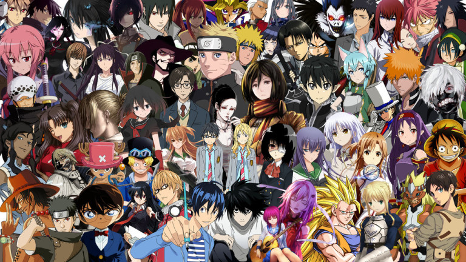

<h2>★PROJECT PROBLEM SOLVING IN INFORMATION TECHNOLOGY★</h2>
 
<h2>Most Popular Anime</h2>
<h3>۞Objective</h3>
&nbsp;&nbsp;&nbsp;&nbsp;&nbsp;&nbsp;&nbsp;&nbsp;&nbsp;&nbsp;จัดทำโปรแกรมเพื่อศึกษาและวิเคราะห์ข้อมูลผู้ชมอนิเมะว่า ตลอดช่วงระยะเวลาที่ผ่านมา อนิเมะเรื่องไหนมีจำนวนผู้ชมเยอะมากที่สุด คะแนนที่เรื่องนั้นได้รับ เทียบกับจำนวนคะแนนและคนดูโดยรวม และในช่วงปี 2016 - 2017 นี้แต่ละ Season นั้น มีเรื่องไหนได้รับความนิยมจากคนดูมากที่สุด และเป็นอนิเมะแนวไหน โดยข้อมูลทั้งหมดจะอ้างอิงมาจากเว็บไซต์ https://myanimelist.net/ 

<h3>۞What is Anime ?</h3>
&nbsp;&nbsp;&nbsp;&nbsp;&nbsp;&nbsp;&nbsp;&nbsp;&nbsp;&nbsp;Anime คือ เป็นคำภาษาญี่ปุ่นที่มาจากภาษาอังกฤษว่า แอนิเมชัน (animation) ซึ่งมาจาก 
ภาษาฝรั่งเศสอนิเมะ(animé) และจากภาษาละติน แปลว่าเคลื่อนไหว หรือภาพเคลื่อนไหว แต่ความหมายกลายจนเป็นคำเฉพาะของภาษาญี่ปุ่นแปลว่า ภาพยนต์การ์ตูน ภายนอกประเทศญี่ปุ่น อนิเมะหมายถึงภาพยนตร์การ์ตูนสัญชาติญี่ปุ่น ซึ่งส่วนใหญ่มีลักษณะทางศิลปะแตกต่างกับภาพยนตร์การ์ตูนจากแหล่งอื่น อนิเมะส่วนใหญ่จะวาดขึ้นด้วยมือ แต่ปัจจุบันมีการนำคอมพิวเตอร์มาช่วยสร้างอนิเมะอย่างแพร่หลาย อนิเมะส่วนใหญ่สร้างขึ้นเพื่อให้ความบันเทิงเหมือนภาพยนตร์ โดยมีแนวเรื่องหลากหลายและครอบคลุมแนววรรณกรรมเกือบทุกแนว อนิเมะส่วนใหญ่ถูกสร้างขึ้นเป็นตอนๆ เพื่อฉายทางโทรทัศน์ ส่วนหนึ่งถูกสร้างเป็นภาพยนตร์การ์ตูนเรื่องยาวเพื่อฉายในโรงภาพยนตร์ และอีกส่วนหนึ่งถูกสร้างเป็นตอนๆ เพื่อขายตรงในรูปแบบดีวีดี วีซีดี หรือวีดิโอ ดูมีการทำตอนเฉพาะที่เรียกว่า โอวีเอ อนิเมะหลายเรื่องถูกดัดแปลงมาจากมังงะนอกจากนี้ยังมีอนิเมะที่ถูกนำไปดัดแปลงเป็นละครโทรทัศน์อีกด้วย

<h4>Info : ไฟล์ csv จะประกอบไปด้วย</h4>
 ❖Audience : ผู้ชม / สมาชิก ที่ดูAnimeเรื่องนั้นๆ 
 ❖Score    : คะแนนที่มาจากสมาชิกของเว็ปไซด์ MyAnimeList.net 
 ❖Season   : ฤดูกาลต่างๆ เช่น ฤดูหนาว ฤดูร้อน ฯลฯ ซึ่งภายในช่วงฤดูกาลนั้นๆ จะมี Anime ที่เข้าฉายแตกต่างกันไป 
 ❖Tag      : คำสั้นๆที่อาจบ่งบอกถึงเนื้อหาต่างๆ ว่ามีลักษณะเกี่ยวข้องกันกับเรืองนั้นๆอย่างไร

<h3> ❤Members </h3>
&nbsp;&nbsp;&nbsp;&nbsp;&nbsp;&nbsp;&nbsp;&nbsp;&nbsp;&nbsp;&nbsp;&nbsp;&nbsp;&nbsp;&nbsp;&nbsp;&nbsp;&nbsp;&nbsp;&nbsp;&nbsp;&nbsp;&nbsp;&nbsp;
&nbsp;&nbsp;&nbsp;&nbsp;&nbsp;&nbsp;&nbsp;&nbsp;&nbsp;&nbsp;&nbsp;&nbsp;&nbsp;&nbsp;&nbsp;&nbsp;
&nbsp;&nbsp;&nbsp;&nbsp;&nbsp;&nbsp;&nbsp;&nbsp;&nbsp;&nbsp;&nbsp;&nbsp;&nbsp;&nbsp;&nbsp;&nbsp;
&nbsp;&nbsp;&nbsp;&nbsp;&nbsp;&nbsp;&nbsp;&nbsp;&nbsp;&nbsp;&nbsp;&nbsp;&nbsp;&nbsp;&nbsp;&nbsp;

&nbsp;&nbsp;&nbsp;&nbsp;&nbsp;&nbsp;&nbsp;&nbsp;&nbsp;&nbsp;&nbsp;&nbsp;&nbsp;&nbsp;&nbsp;&nbsp;&nbsp;&nbsp;&nbsp;&nbsp;&nbsp;&nbsp;&nbsp;&nbsp;&nbsp;&nbsp;&nbsp;61070056 &nbsp;&nbsp;&nbsp;&nbsp;&nbsp;&nbsp;&nbsp;&nbsp;&nbsp;&nbsp;&nbsp;&nbsp;&nbsp;&nbsp;&nbsp;&nbsp;&nbsp;&nbsp;&nbsp;&nbsp;&nbsp;&nbsp;661070125 &nbsp;&nbsp;&nbsp;&nbsp;&nbsp;&nbsp;&nbsp;&nbsp;&nbsp;&nbsp;&nbsp;&nbsp;&nbsp;&nbsp;&nbsp;&nbsp;&nbsp;&nbsp;&nbsp;&nbsp;&nbsp;&nbsp;&nbsp;61070130 &nbsp;&nbsp;&nbsp;&nbsp;&nbsp;&nbsp;&nbsp;&nbsp;&nbsp;&nbsp;&nbsp;&nbsp;&nbsp;&nbsp;&nbsp;&nbsp;&nbsp;&nbsp;&nbsp;&nbsp;&nbsp;&nbsp;&nbsp;61070234
